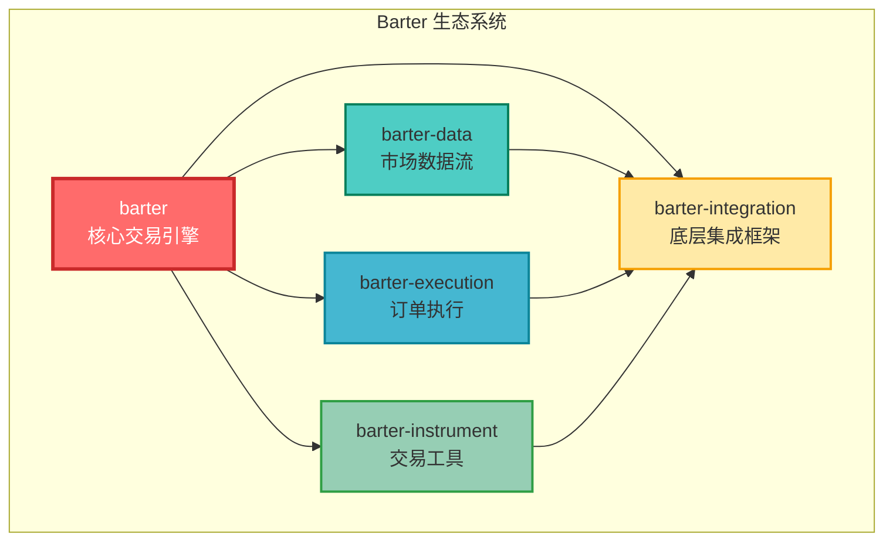
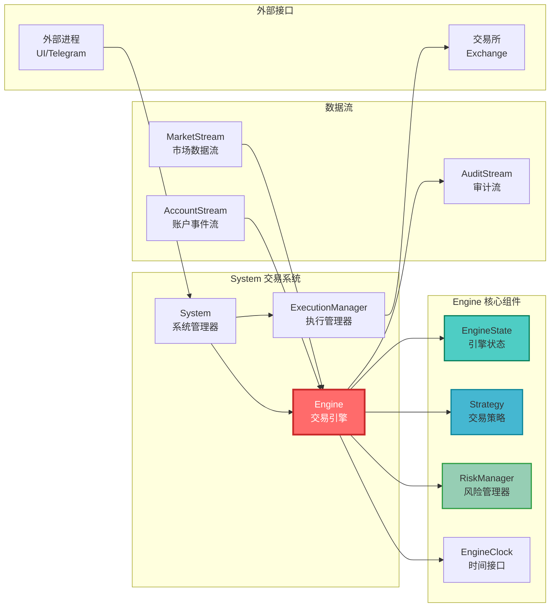
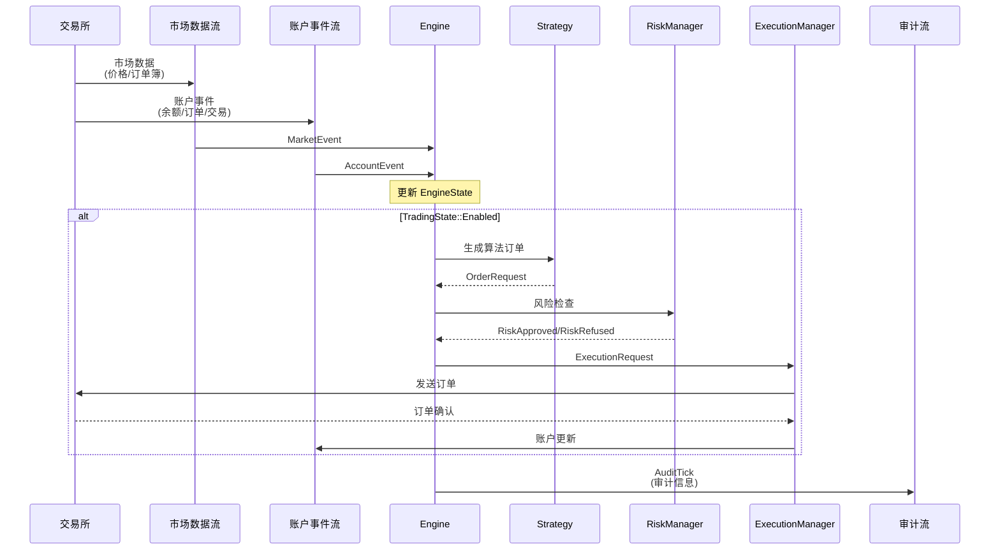
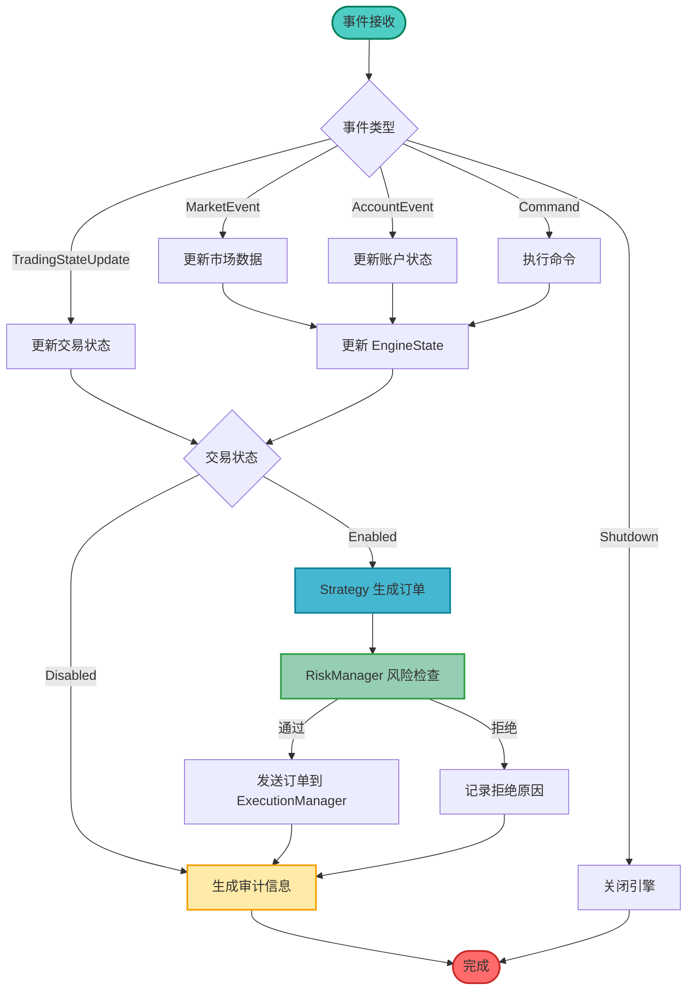
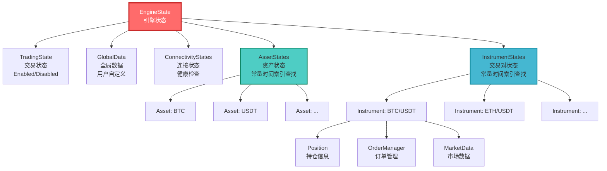

# Barter

Barter 是一个用于构建高性能实盘交易、模拟交易和回测系统的 Rust 库算法交易生态系统。

-   **快速**：使用原生 Rust 编写。最小化分配。具有直接索引查找的数据导向状态管理系统。
-   **健壮**：强类型。线程安全。广泛的测试覆盖。
-   **可定制**：即插即用的 `Strategy` 和 `RiskManager` 组件，支持大多数交易策略（做市、统计套利、高频交易等）。
-   **可扩展**：采用模块化设计的多线程架构。利用 Tokio 进行 I/O。内存高效的数据结构。

**请参阅：[`Barter`]、[`Barter-Data`]、[`Barter-Instrument`]、[`Barter-Execution`] 和 [`Barter-Integration`] 以获取每个库的完整文档和示例。**

[![Crates.io][crates-badge]][crates-url]
[![MIT licensed][mit-badge]][mit-url]
[![Discord chat][discord-badge]][discord-url]
[![DeepWiki][deepwiki-badge]][deepwiki-url]

[crates-badge]: https://img.shields.io/crates/v/barter.svg
[crates-url]: https://crates.io/crates/barter
[mit-badge]: https://img.shields.io/badge/license-MIT-blue.svg
[mit-url]: https://github.com/barter-rs/barter-rs/blob/develop/LICENSE
[discord-badge]: https://img.shields.io/discord/910237311332151317.svg?logo=discord&style=flat-square
[discord-url]: https://discord.gg/wE7RqhnQMV
[deepwiki-badge]: https://deepwiki.com/badge.svg
[deepwiki-url]: https://deepwiki.com/barter-rs/barter-rs
[`Barter`]: https://crates.io/crates/barter
[`Barter-Instrument`]: https://crates.io/crates/barter-instrument
[`Barter-Data`]: https://crates.io/crates/barter-data
[`Barter-Execution`]: https://crates.io/crates/barter-execution
[`Barter-Integration`]: https://crates.io/crates/barter-integration
[API Documentation]: https://docs.rs/barter/latest/barter/
[Chat]: https://discord.gg/wE7RqhnQMV

## 概述

Barter 是一个用于构建高性能实盘交易、模拟交易和回测系统的 Rust 库算法交易生态系统。它由几个易于使用、可扩展的 crate 组成：

-   **Barter**：具有功能丰富的状态管理系统的算法交易引擎。
-   **Barter-Instrument**：交易所、工具和资产数据结构和工具。
-   **Barter-Data**：从金融场所流式传输公共市场数据。通过 `MarketStream` 接口易于扩展。
-   **Barter-Execution**：流式传输私有账户数据并执行订单。通过 `ExecutionClient` 接口易于扩展。
-   **Barter-Integration**：用于灵活 REST/WebSocket 集成的底层框架。

## 系统架构

### 模块架构图



### 核心组件架构



### 数据流程图



### Engine 内部工作流程



### EngineState 状态结构



## 主要特性

-   通过 [`Barter-Data`] 库从金融场所流式传输公共市场数据。
-   通过 [`Barter-Execution`] 库流式传输私有账户数据，执行订单（实盘或模拟）\*\*。
-   即插即用的 `Strategy` 和 `RiskManager` 组件，支持大多数交易策略。
-   用于高效运行数千个并发回测的回测工具。
-   灵活的 `Engine`，支持在多个交易所同时执行的交易策略。
-   使用模拟 `MarketStream` 或 `Execution` 组件，可以在与实盘交易几乎相同的交易系统上启用回测。
-   使用索引数据结构进行 O(1) 常量查找的集中式缓存友好状态管理系统。
-   健壮的订单管理系统 - 可独立使用或与 Barter 一起使用。
-   具有综合性能指标的交易摘要（PnL、Sharpe、Sortino、Drawdown 等）。
-   从外部进程（例如 UI、Telegram 等）开启/关闭算法交易，同时仍处理市场/账户数据。
-   从外部进程（例如 UI、Telegram 等）发出 `Engine` 命令以启动操作（CloseAllPositions、OpenOrders、CancelOrders 等）。
-   处理 `Engine` AuditStream 的 `EngineState` 副本管理器，以支持非热路径监控组件（例如 UI、Telegram 等）。

[barter-examples]: https://github.com/barter-rs/barter-rs/tree/develop/barter/examples

## 示例

-   请参阅[此处][barter-examples]查看包含导入的可编译示例。
-   请参阅子模块以获取每个库的更多示例。

#### 使用实时市场数据和模拟执行的模拟交易

```rust,no_run
const FILE_PATH_SYSTEM_CONFIG: &str = "barter/examples/config/system_config.json";
const RISK_FREE_RETURN: Decimal = dec!(0.05);

#[tokio::main]
async fn main() -> Result<(), Box<dyn std::error::Error>> {
    // 初始化追踪
    init_logging();

    // 加载系统配置
    let SystemConfig {
        instruments,
        executions,
    } = load_config()?;

    // 构建索引化工具
    let instruments = IndexedInstruments::new(instruments);

    // 初始化市场数据流
    let market_stream = init_indexed_multi_exchange_market_stream(
        &instruments,
        &[SubKind::PublicTrades, SubKind::OrderBooksL1],
    )
    .await?;

    // 构建系统参数
    let args = SystemArgs::new(
        &instruments,
        executions,
        LiveClock,
        DefaultStrategy::default(),
        DefaultRiskManager::default(),
        market_stream,
    );

    // 构建并运行完整系统：
    // 请参阅 SystemBuilder 了解所有配置选项
    let mut system = SystemBuilder::new(args)
        // Engine 以同步模式运行（迭代器输入）
        .engine_feed_mode(EngineFeedMode::Iterator)

        // 启用审计流（Engine 发送审计）
        .audit_mode(AuditMode::Enabled)

        // Engine 启动时 TradingState::Disabled
        .trading_state(TradingState::Disabled)

        // 构建系统，但尚未开始生成任务
        .build::<EngineEvent, DefaultGlobalData, DefaultInstrumentMarketData>()?

        // 初始化系统，在当前运行时上生成组件任务
        .init_with_runtime(tokio::runtime::Handle::current())
        .await?;

    // 获取 Engine 审计接收器的所有权
    let audit_rx = system.audit_rx.take().unwrap();

    // 运行虚拟异步 AuditStream 消费者
    // 注意：您可能希望使用此流来复制 EngineState，或持久化事件等。
    //  --> 例如，请参阅 examples/engine_sync_with_audit_replica_engine_state
    let audit_task = tokio::spawn(async move {
        let mut audit_stream = audit_rx.into_stream();
        while let Some(audit) = audit_stream.next().await {
            debug!(?audit, "AuditStream consumed AuditTick");
            if let EngineAudit::Shutdown(_) = audit.event {
                break;
            }
        }
        audit_stream
    });

    // 启用交易
    system.trading_state(TradingState::Enabled);

    // 让示例运行 5 秒...
    tokio::time::sleep(Duration::from_secs(5)).await;

    // 在关闭之前，先取消订单，然后平仓
    system.cancel_orders(InstrumentFilter::None);
    system.close_positions(InstrumentFilter::None);

    // 关闭
    let (engine, _shutdown_audit) = system.shutdown().await?;
    let _audit_stream = audit_task.await?;

    // 生成 TradingSummary<Daily>
    let trading_summary = engine
        .trading_summary_generator(RISK_FREE_RETURN)
        .generate(Daily);

    // 将 TradingSummary<Daily> 打印到终端（可以保存到文件、发送到某处等）
    trading_summary.print_summary();

    Ok(())
}

fn load_config() -> Result<SystemConfig, Box<dyn std::error::Error>> {
    let file = File::open(FILE_PATH_SYSTEM_CONFIG)?;
    let reader = BufReader::new(file);
    let config = serde_json::from_reader(reader)?;
    Ok(config)
}
```

## 获取帮助

首先，请查看[API 文档][API Documentation]中是否已有您问题的答案。如果找不到答案，我很乐意通过[聊天][Chat]在 Discord 上帮助您并尝试回答您的问题。

## 支持 Barter 开发

通过成为赞助商（或给我小费！）来帮助我们推进 Barter 的能力。

您的贡献将使我能够投入更多时间到 Barter，加速功能开发和改进。

**请发送邮件至 *justastream.code@gmail.com* 进行所有咨询**

### 赞助层级

-   🥇 **赞助商** - 您的姓名、徽标和网站链接将显示在下方。
-   🥈 **支持者** - 您的姓名将列为支持者。

### 当前赞助商

_您的姓名、徽标和网站链接可以在这里显示_

### 当前支持者

_您的姓名可以在这里显示_

---

**感谢所有赞助商和支持者！🫶**

## 贡献

提前感谢您帮助开发 Barter 生态系统！请通过 Discord [聊天][Chat]联系我们，讨论开发、新功能和未来路线图。

### 许可证

本项目采用 [MIT 许可证][MIT license]。

[MIT license]: https://github.com/barter-rs/barter-rs/blob/develop/LICENSE

### 贡献许可协议

您有意提交以包含在 Barter 工作空间 crate 中的任何贡献均应：

1. 采用 MIT 许可证
2. 受以下所有免责声明和责任限制的约束
3. 不提供任何附加条款或条件
4. 在理解仅用于教育目的和风险警告的前提下提交

通过提交贡献，您证明您有权根据这些条款这样做。

## 法律免责声明和责任限制

在使用本软件之前，请仔细阅读本免责声明。通过访问或使用本软件，您承认并同意受本条款的约束。

1. 教育目的
   本软件及相关文档（"软件"）仅用于教育和研究目的。本软件不适用于、未设计、未测试、未验证或未认证用于商业部署、实盘交易或任何形式的生产使用。

2. 非财务建议
   软件中包含的任何内容均不构成财务、投资、法律或税务建议。软件的任何方面都不应被依赖用于交易决策或财务规划。强烈建议用户咨询合格的专业人士，以获得适合其情况的投资指导。

3. 风险承担
   金融市场交易，包括但不限于加密货币、证券、衍生品和其他金融工具，存在重大损失风险。用户承认：
   a) 他们可能损失全部投资；
   b) 过往表现不代表未来结果；
   c) 假设或模拟的性能结果具有固有的局限性和偏差。

4. 免责声明
   本软件按"原样"提供，不提供任何形式的明示或暗示保证。在法律允许的最大范围内，作者和版权持有人明确否认所有保证，包括但不限于：
   a) 适销性
   b) 特定用途的适用性
   c) 不侵权
   d) 结果的准确性或可靠性
   e) 系统集成
   f) 安静享用

5. 责任限制
   在任何情况下，作者、版权持有人、贡献者或任何关联方均不对任何直接、间接、偶然、特殊、惩戒性或后果性损害（包括但不限于采购替代商品或服务、使用损失、数据或利润损失；或业务中断）承担责任，无论因何原因引起，也无论基于任何责任理论，无论是合同、严格责任还是侵权（包括疏忽或其他），即使已被告知此类损害的可能性。

6. 监管合规
   本软件未在任何金融监管机构注册、认可或批准。用户全权负责：
   a) 确定其使用是否符合适用的法律法规
   b) 获得任何所需的许可证、许可或注册
   c) 满足其管辖范围内的任何监管义务

7. 赔偿
   用户同意赔偿、辩护并使作者、版权持有人和任何关联方免受因使用本软件而产生的任何索赔、责任、损害、损失和费用。

8. 确认
   通过使用本软件，用户确认已阅读本免责声明，理解并同意受其条款和条件的约束。

上述限制可能不适用于不允许排除某些保证或限制责任的司法管辖区。
