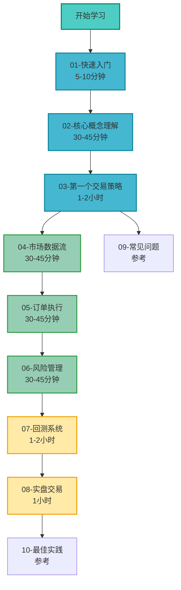

# Barter-rs 教程目录

欢迎来到 Barter-rs 教程！本教程将帮助你从零开始学习如何使用 Barter-rs 构建算法交易系统。

## 📚 学习路径

## 📖 文档索引

### 🚀 快速入门系列（必读）

这些文档是学习 Barter-rs 的基础，建议按顺序阅读。

| 文档                                        | 标题           | 难度   | 预计时间   | 描述                                          |
| ------------------------------------------- | -------------- | ------ | ---------- | --------------------------------------------- |
| [01-快速入门](./01-快速入门.md)             | 快速入门       | ⭐     | 5-10 分钟  | 5 分钟快速开始，运行第一个示例                |
| [02-核心概念理解](./02-核心概念理解.md)     | 核心概念理解   | ⭐⭐   | 30-45 分钟 | 理解 Engine、Strategy、RiskManager 等核心概念 |
| [03-第一个交易策略](./03-第一个交易策略.md) | 第一个交易策略 | ⭐⭐⭐ | 1-2 小时   | 手把手编写你的第一个交易策略                  |

### 📚 进阶主题（深入学习）

掌握基础后，深入学习各个模块的详细用法。

| 文档                                | 标题       | 难度   | 预计时间   | 描述                                 |
| ----------------------------------- | ---------- | ------ | ---------- | ------------------------------------ |
| [04-市场数据流](./04-市场数据流.md) | 市场数据流 | ⭐⭐⭐ | 30-45 分钟 | 深入理解 MarketStream 和市场数据处理 |
| [05-订单执行](./05-订单执行.md)     | 订单执行   | ⭐⭐⭐ | 30-45 分钟 | 理解 Execution 系统和订单管理        |
| [06-风险管理](./06-风险管理.md)     | 风险管理   | ⭐⭐⭐ | 30-45 分钟 | 实现自定义 RiskManager 和风险控制    |

### 🎯 实战指南（实际应用）

将所学知识应用到实际场景中。

| 文档                            | 标题     | 难度     | 预计时间 | 描述                     |
| ------------------------------- | -------- | -------- | -------- | ------------------------ |
| [07-回测系统](./07-回测系统.md) | 回测系统 | ⭐⭐⭐⭐ | 1-2 小时 | 使用历史数据回测策略性能 |
| [08-实盘交易](./08-实盘交易.md) | 实盘交易 | ⭐⭐⭐⭐ | 1 小时   | 配置和部署实盘交易系统   |

### 📋 参考文档（随时查阅）

遇到问题时可以查阅的参考资料。

| 文档                            | 标题     | 描述               |
| ------------------------------- | -------- | ------------------ |
| [09-常见问题](./09-常见问题.md) | 常见问题 | FAQ 和问题解决方案 |
| [10-最佳实践](./10-最佳实践.md) | 最佳实践 | 开发建议和最佳实践 |

## 🎯 前置要求

在开始学习之前，请确保你已经具备以下基础知识：

### 必需知识

-   **Rust 基础**：

    -   变量、函数、结构体、枚举
    -   所有权和借用
    -   错误处理（Result、Option）
    -   基本 Trait 使用

-   **Cargo 使用**：
    -   创建项目
    -   添加依赖
    -   运行和构建项目

### 推荐知识（可选）

-   **异步编程**：

    -   Tokio 基础
    -   async/await 语法
    -   Stream 和 Future

-   **算法交易基础**：
    -   交易基本概念（订单、持仓、盈亏）
    -   市场数据（价格、订单簿）
    -   风险管理基础

## 🗺️ 推荐阅读顺序

### 新手路径（推荐）

如果你是第一次接触 Barter-rs，建议按以下顺序学习：

1. **快速入门** → 了解项目，运行第一个示例
2. **核心概念理解** → 理解系统架构和核心组件
3. **第一个交易策略** → 编写你的第一个策略
4. **市场数据流** → 深入学习市场数据处理
5. **订单执行** → 理解订单执行流程
6. **风险管理** → 实现风险控制
7. **回测系统** → 测试策略性能
8. **实盘交易** → 部署到实盘环境

### 快速参考路径

如果你已经熟悉算法交易，只是想快速了解 Barter-rs：

1. **快速入门** → 快速了解项目
2. **核心概念理解** → 理解核心组件
3. **第一个交易策略** → 查看代码示例
4. **常见问题** → 查找遇到的问题

### 主题学习路径

如果你想深入学习某个特定主题：

-   **策略开发**：02 → 03 → 06 → 07
-   **系统集成**：02 → 04 → 05 → 08
-   **性能优化**：02 → 07 → 10

## 💡 学习建议

1. **循序渐进**：不要跳过基础文档，每个概念都很重要
2. **动手实践**：每篇文档都有代码示例，一定要自己运行和修改
3. **理解原理**：不仅要会用，还要理解为什么这样设计
4. **查阅参考**：遇到问题及时查阅常见问题和最佳实践
5. **社区交流**：加入 Discord 社区，与其他开发者交流

## 🔗 相关资源

-   **项目仓库**：[GitHub](https://github.com/barter-rs/barter-rs)
-   **API 文档**：[docs.rs](https://docs.rs/barter/latest/barter/)
-   **Discord 社区**：[加入讨论](https://discord.gg/wE7RqhnQMV)
-   **术语表**：[术语表](./术语表.md)

## 📝 文档反馈

如果你发现文档有任何问题或改进建议，欢迎：

-   提交 Issue
-   提交 Pull Request
-   在 Discord 社区反馈

---

**开始你的 Barter-rs 学习之旅吧！** 🚀

建议从 [01-快速入门](./01-快速入门.md) 开始。
