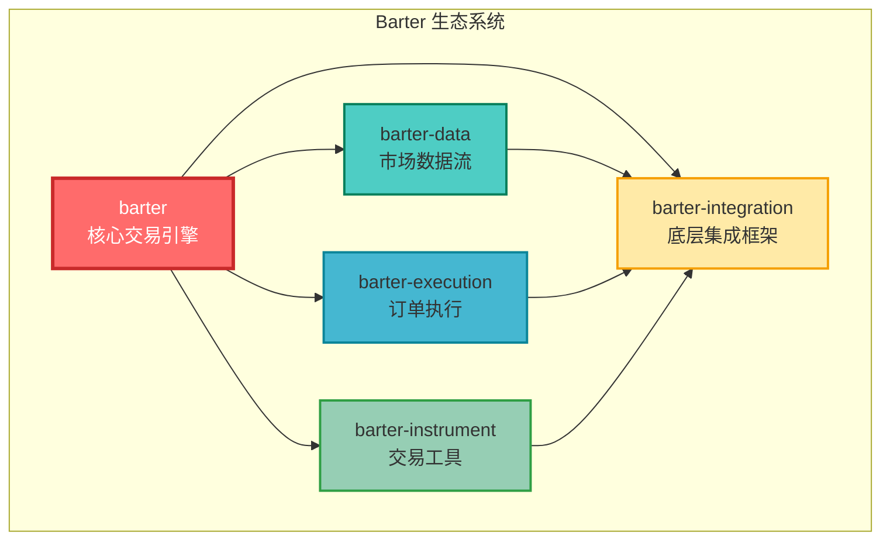
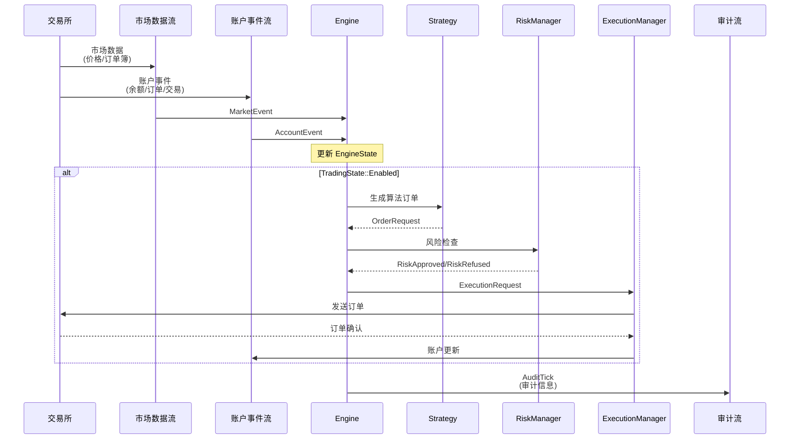
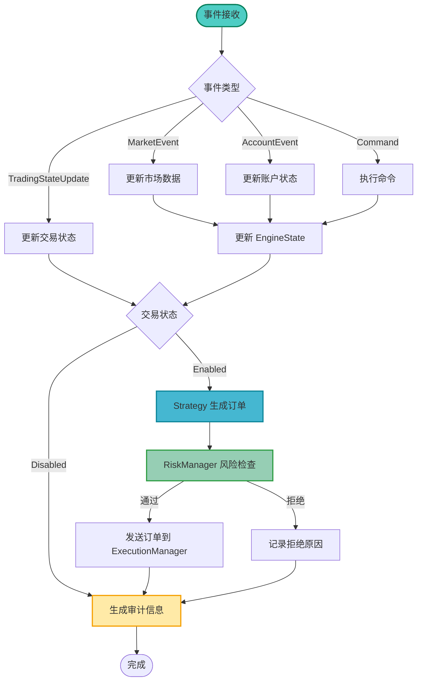
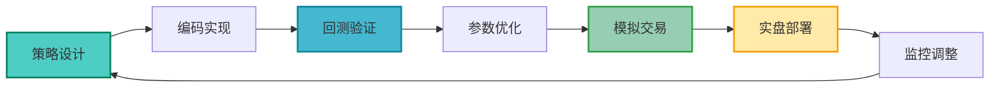
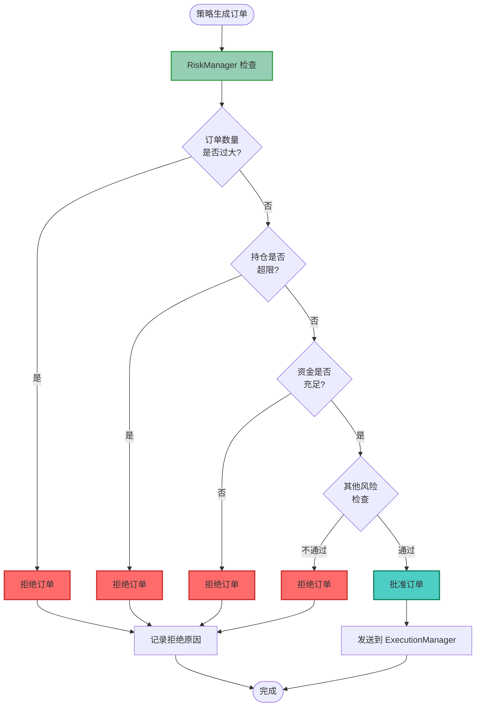
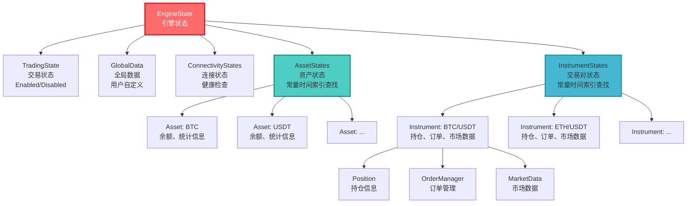
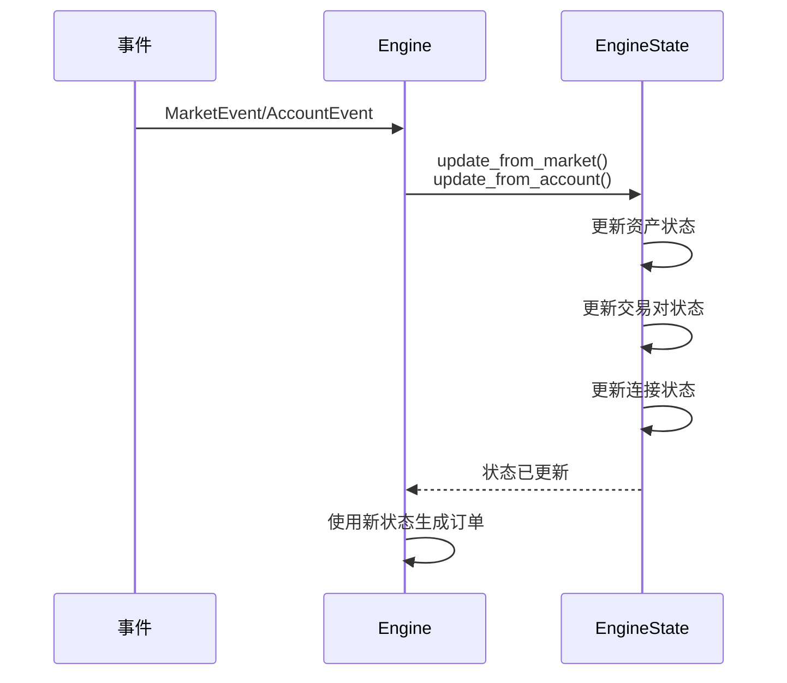
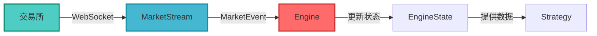
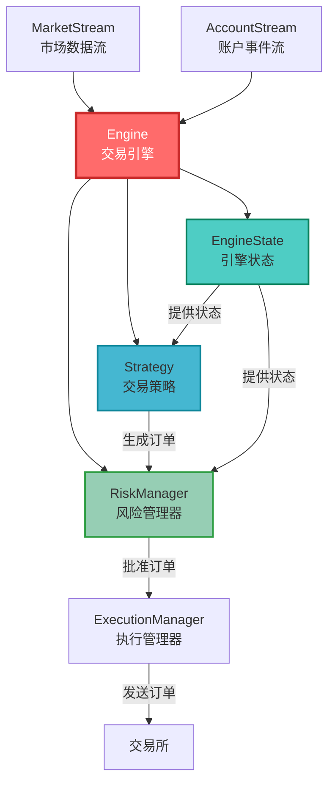

# 02-核心概念理解

理解 Barter-rs 的核心概念是掌握整个系统的关键。本教程将深入讲解 Engine、Strategy、RiskManager 等核心组件，帮助你建立完整的知识体系。

## 🎯 学习目标

完成本教程后，你将能够：

-   ✅ 理解 Barter-rs 的整体架构
-   ✅ 掌握 Engine（交易引擎）的工作原理
-   ✅ 理解 Strategy（交易策略）的三要素
-   ✅ 了解 RiskManager（风险管理器）的作用
-   ✅ 理解 EngineState（引擎状态）的结构
-   ✅ 掌握 MarketEvent（市场事件）的流转过程

## 📐 整体架构概览

在深入细节之前，让我们先看看 Barter-rs 的整体架构。

### 系统架构图

Barter-rs 采用模块化设计，由多个 crate 组成：



### 数据流程图

数据在系统中的流转过程：



## 🧠 Engine（交易引擎）- 系统的大脑

### 什么是 Engine？

**Engine（交易引擎）** 是 Barter-rs 的核心组件，就像交易系统的"大脑"。它负责协调所有组件，处理交易逻辑。

### 类比理解

想象 Engine 就像一个智能交易助手：

-   **接收信息**：从市场数据流和账户流接收最新信息
-   **分析决策**：根据策略分析当前情况
-   **执行操作**：发送订单、管理持仓
-   **记录日志**：记录所有操作供后续分析

### Engine 的主要功能

1. **事件处理**：处理市场事件、账户事件、命令等
2. **状态管理**：维护完整的交易状态（EngineState）
3. **策略执行**：调用 Strategy 生成交易订单
4. **风险检查**：通过 RiskManager 检查订单
5. **订单执行**：将订单发送到 ExecutionManager

### Engine 的工作原理

Engine 采用**事件驱动架构**：



### Engine 的组成

Engine 包含以下组件：

```rust
pub struct Engine<Clock, State, ExecutionTxs, Strategy, Risk> {
    pub clock: Clock,           // 时间接口（支持回测）
    pub meta: EngineMeta,        // 元数据（启动时间、序列号）
    pub state: State,            // 引擎状态（EngineState）
    pub execution_txs: ExecutionTxs,  // 执行请求发送器
    pub strategy: Strategy,      // 交易策略
    pub risk: Risk,              // 风险管理器
}
```

## 📊 Strategy（交易策略）- 交易决策者

### 什么是 Strategy？

**Strategy（交易策略）** 定义了**何时买入、何时卖出**的交易逻辑。它是算法交易的核心。

### 策略三要素（参考 Freqtrade）

一个完整的交易策略包含三个核心要素：

#### 1. 入场规则（Entry Logic）

**定义**：什么时候开仓买入

**示例**：

-   价格突破前期高点
-   短期均线上穿长期均线（金叉）
-   RSI 指标从超卖区域反弹
-   成交量突然放大

**代码示例**：

```rust
impl AlgoStrategy for MyStrategy {
    fn generate_algo_orders(&self, state: &EngineState) -> (Vec<OrderRequestCancel>, Vec<OrderRequestOpen>) {
        let mut opens = Vec::new();

        // 遍历所有交易对
        for (instrument_index, instrument_state) in state.instruments.iter() {
            // 获取最新价格
            if let Some(latest_price) = instrument_state.market_data.latest_price() {
                // 入场规则：价格突破 100 日均线
                if latest_price > instrument_state.market_data.ma_100() {
                    opens.push(OrderRequestOpen {
                        // ... 订单详情
                    });
                }
            }
        }

        (Vec::new(), opens)
    }
}
```

#### 2. 出场规则（Exit Logic）

**定义**：什么时候平仓卖出

**示例**：

-   达到预设的止盈目标
-   触发止损价格
-   短期均线下穿长期均线（死叉）
-   RSI 指标进入超买区域

**代码示例**：

```rust
impl AlgoStrategy for MyStrategy {
    fn generate_algo_orders(&self, state: &EngineState) -> (Vec<OrderRequestCancel>, Vec<OrderRequestOpen>) {
        let mut cancels = Vec::new();
        let mut opens = Vec::new();

        // 检查现有持仓
        for (instrument_index, instrument_state) in state.instruments.iter() {
            if let Some(position) = instrument_state.position {
                // 出场规则：达到 5% 止盈
                if position.unrealized_pnl_percent() >= 5.0 {
                    // 生成平仓订单
                    opens.push(OrderRequestOpen {
                        side: Side::Sell,  // 卖出平仓
                        // ... 其他订单详情
                    });
                }
            }
        }

        (cancels, opens)
    }
}
```

#### 3. 风险管理（Risk Management）

**定义**：控制每笔交易的风险暴露

**包括**：

-   **仓位大小**：每次买入多少
-   **止损设置**：最大亏损容忍度
-   **止盈设置**：目标盈利水平
-   **最大持仓数**：同时持有多少个交易对

**代码示例**：

```rust
impl AlgoStrategy for MyStrategy {
    fn generate_algo_orders(&self, state: &EngineState) -> (Vec<OrderRequestCancel>, Vec<OrderRequestOpen>) {
        let mut opens = Vec::new();

        // 风险管理：限制每次买入金额不超过总资金的 10%
        let total_balance = state.assets.get(&usdt_index).balance.total;
        let max_order_value = total_balance * Decimal::from(10) / Decimal::from(100);

        for (instrument_index, instrument_state) in state.instruments.iter() {
            if should_buy(instrument_state) {
                // 计算订单数量，确保不超过最大金额
                let order_quantity = calculate_quantity(max_order_value, instrument_state.latest_price());

                opens.push(OrderRequestOpen {
                    quantity: order_quantity,
                    // ... 其他订单详情
                });
            }
        }

        (Vec::new(), opens)
    }
}
```

### Strategy Trait 接口

所有策略都必须实现 `AlgoStrategy` trait：

```rust
pub trait AlgoStrategy<ExchangeKey, InstrumentKey> {
    type State;  // 策略使用的状态类型（通常是 EngineState）

    fn generate_algo_orders(
        &self,
        state: &Self::State,
    ) -> (
        impl IntoIterator<Item = OrderRequestCancel<ExchangeKey, InstrumentKey>>,
        impl IntoIterator<Item = OrderRequestOpen<ExchangeKey, InstrumentKey>>,
    );
}
```

### 策略生命周期

策略从设计到实盘的完整流程：



## 🛡️ RiskManager（风险管理器）- 安全卫士

### 什么是 RiskManager？

**RiskManager（风险管理器）** 是交易系统的"安全卫士"，负责检查策略生成的订单是否符合风险要求。

### 类比理解

想象 RiskManager 就像银行的贷款审核员：

-   **检查申请**：审查每笔订单请求
-   **评估风险**：判断是否安全
-   **批准或拒绝**：通过或拒绝订单
-   **记录原因**：记录拒绝的原因

### RiskManager 的作用

1. **过滤高风险订单**：拒绝可能导致过度风险的订单
2. **限制订单数量**：防止单笔订单过大
3. **检查持仓限制**：确保不超过最大持仓数
4. **资金管理**：确保有足够的资金执行订单

### RiskManager 工作流程



### RiskManager Trait 接口

```rust
pub trait RiskManager<ExchangeKey, InstrumentKey> {
    type State;  // 风险管理器使用的状态类型

    fn check(
        &self,
        state: &Self::State,
        cancels: impl IntoIterator<Item = OrderRequestCancel<ExchangeKey, InstrumentKey>>,
        opens: impl IntoIterator<Item = OrderRequestOpen<ExchangeKey, InstrumentKey>>,
    ) -> (
        impl IntoIterator<Item = RiskApproved<OrderRequestCancel<...>>>,
        impl IntoIterator<Item = RiskApproved<OrderRequestOpen<...>>>,
        impl IntoIterator<Item = RiskRefused<OrderRequestCancel<...>>>,
        impl IntoIterator<Item = RiskRefused<OrderRequestOpen<...>>>,
    );
}
```

### 风险检查示例

```rust
impl RiskManager for MyRiskManager {
    type State = EngineState<DefaultGlobalData, DefaultInstrumentMarketData>;

    fn check(
        &self,
        state: &Self::State,
        cancels: impl IntoIterator<Item = OrderRequestCancel>,
        opens: impl IntoIterator<Item = OrderRequestOpen>,
    ) -> (Vec<RiskApproved<...>>, Vec<RiskApproved<...>>, Vec<RiskRefused<...>>, Vec<RiskRefused<...>>) {
        let mut approved_opens = Vec::new();
        let mut refused_opens = Vec::new();

        for order in opens {
            // 检查 1：订单数量是否超过限制
            if order.quantity > self.max_order_quantity {
                refused_opens.push(RiskRefused::new(
                    order,
                    format!("订单数量 {} 超过最大限制 {}", order.quantity, self.max_order_quantity)
                ));
                continue;
            }

            // 检查 2：持仓是否超限
            if state.instruments.get(&order.instrument).position_count() >= self.max_positions {
                refused_opens.push(RiskRefused::new(
                    order,
                    "持仓数量已达上限"
                ));
                continue;
            }

            // 检查 3：资金是否充足
            let required_funds = order.quantity * order.price;
            let available_balance = state.assets.get(&usdt_index).balance.free;
            if required_funds > available_balance {
                refused_opens.push(RiskRefused::new(
                    order,
                    format!("资金不足：需要 {}，可用 {}", required_funds, available_balance)
                ));
                continue;
            }

            // 所有检查通过
            approved_opens.push(RiskApproved::new(order));
        }

        (Vec::new(), approved_opens, Vec::new(), refused_opens)
    }
}
```

## 💾 EngineState（引擎状态）- 系统记忆

### 什么是 EngineState？

**EngineState（引擎状态）** 是 Engine 的"记忆"，维护了系统的完整状态信息。

### EngineState 的结构



### EngineState 的组成部分

#### 1. TradingState（交易状态）

控制算法交易是否启用：

```rust
pub enum TradingState {
    Enabled,   // 启用：Strategy 会生成订单
    Disabled,  // 禁用：Strategy 不会生成订单
}
```

#### 2. AssetStates（资产状态）

管理所有资产的状态（如 BTC、USDT）：

-   **余额信息**：总余额、可用余额
-   **统计信息**：盈亏、交易次数等
-   **索引查找**：使用 `FnvHashMap` 实现 O(1) 快速查找

#### 3. InstrumentStates（交易对状态）

管理所有交易对的状态（如 BTC/USDT）：

-   **持仓信息**：当前持仓、盈亏
-   **订单管理**：未完成订单、订单历史
-   **市场数据**：最新价格、订单簿等

#### 4. ConnectivityStates（连接状态）

跟踪系统连接健康状态：

-   **全局连接状态**：整体系统是否正常
-   **交易所连接状态**：每个交易所的市场数据和账户连接状态

### 状态更新流程



## 📨 MarketEvent（市场事件）- 市场信息

### 什么是 MarketEvent？

**MarketEvent（市场事件）** 包含市场数据的更新信息，如价格变动、订单簿更新等。

### MarketEvent 的类型

```rust
pub enum DataKind {
    PublicTrades,    // 逐笔交易数据
    OrderBooksL1,    // 一级订单簿（最佳买卖价）
    OrderBooksL2,    // 二级订单簿（深度数据）
    // ... 其他类型
}
```

### 市场事件流转



## 🔗 核心概念关系图

所有核心概念如何协作：



## 💡 关键要点总结

### Engine（交易引擎）

-   ✅ 是系统的核心，协调所有组件
-   ✅ 采用事件驱动架构
-   ✅ 处理事件、维护状态、生成订单

### Strategy（交易策略）

-   ✅ 包含三要素：入场规则、出场规则、风险管理
-   ✅ 实现 `AlgoStrategy` trait
-   ✅ 根据 EngineState 生成订单请求

### RiskManager（风险管理器）

-   ✅ 检查订单是否符合风险要求
-   ✅ 返回 `RiskApproved` 或 `RiskRefused`
-   ✅ 记录拒绝原因，便于调试

### EngineState（引擎状态）

-   ✅ 维护系统的完整状态
-   ✅ 使用索引结构实现快速查找
-   ✅ 包含资产状态、交易对状态、连接状态

### MarketEvent（市场事件）

-   ✅ 包含市场数据更新
-   ✅ 通过 MarketStream 流入 Engine
-   ✅ 触发状态更新和策略执行

## 🎓 练习建议

1. **理解流程**：画出数据从交易所到订单执行的完整流程
2. **分析示例**：查看项目中的示例代码，理解每个组件的作用
3. **思考设计**：思考为什么这样设计？有什么优势？

## 🎯 下一步

现在你已经理解了核心概念，可以开始编写你的第一个交易策略了！

→ [03-第一个交易策略](./03-第一个交易策略.md)

## 📚 延伸阅读

-   [Engine 模块文档](https://docs.rs/barter/latest/barter/engine/)
-   [Strategy 模块文档](https://docs.rs/barter/latest/barter/strategy/)
-   [RiskManager 模块文档](https://docs.rs/barter/latest/barter/risk/)
-   [术语表](./术语表.md)

---

**准备好了吗？让我们开始编写第一个策略！** 🚀
