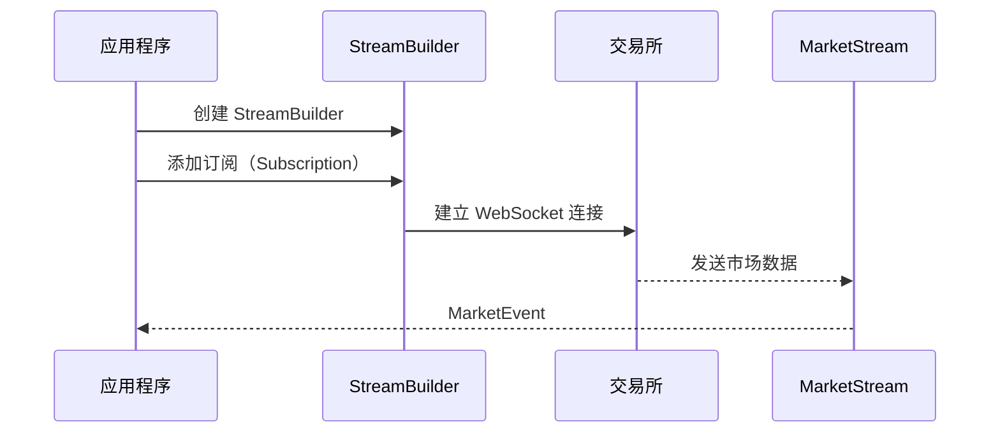

# 04-市场数据流

市场数据是算法交易的基础。本教程将深入讲解如何使用 Barter-rs 获取和处理市场数据流。

## 🎯 学习目标

完成本教程后，你将能够：

-   ✅ 理解 MarketStream 的作用和原理
-   ✅ 订阅不同类型的市场数据
-   ✅ 处理市场事件（MarketEvent）
-   ✅ 在多交易所场景下使用市场数据流
-   ✅ 处理连接断开和重连

## 📊 MarketStream 概述

### 什么是 MarketStream？

**MarketStream（市场数据流）** 是 Barter-rs 中用于接收实时市场数据的接口。它通过 WebSocket 连接从交易所获取数据，并将其转换为标准化的 `MarketEvent`。

### 类比理解

想象 MarketStream 就像：

-   **新闻订阅服务**：你订阅感兴趣的交易对，然后持续接收更新
-   **实时数据管道**：数据从交易所流向你的策略
-   **标准化接口**：不同交易所的数据被统一为相同格式

### MarketStream 的特点

1.  **实时性**：使用 WebSocket 实现低延迟数据传输
2.  **标准化**：所有交易所返回统一的数据格式
3.  **可扩展**：支持添加新的交易所集成
4.  **自动重连**：连接断开时自动重连

## 📈 市场数据类型

Barter-rs 支持多种类型的市场数据：

### 1. PublicTrades（逐笔交易）

**定义**：每笔成交的详细信息

**包含信息**：

-   成交价格
-   成交数量
-   成交时间
-   买卖方向

**使用场景**：

-   计算成交量加权平均价（VWAP）
-   分析市场微观结构
-   检测大单交易

### 2. OrderBooksL1（一级订单簿）

**定义**：最佳买卖价和数量

**包含信息**：

-   最佳买价（Bid）和数量
-   最佳卖价（Ask）和数量
-   价差（Spread）

**使用场景**：

-   获取当前市场价格
-   计算买卖价差
-   快速成交（市价单）

### 3. OrderBooksL2（二级订单簿）

**定义**：更深的订单簿深度数据

**包含信息**：

-   多个价格档位的买卖订单
-   订单簿深度

**使用场景**：

-   分析市场深度
-   计算大单冲击成本
-   做市策略

### 4. Candles（K 线数据）

**定义**：聚合的 K 线数据

**包含信息**：

-   开盘价、最高价、最低价、收盘价
-   成交量
-   时间周期

**使用场景**：

-   技术分析
-   计算技术指标
-   回测系统

### 5. Liquidations（清算数据）

**定义**：强制平仓事件

**使用场景**：

-   分析市场压力
-   检测异常波动

## 🔌 订阅市场数据

### 基本订阅流程



### 单交易所示例

订阅单个交易所的市场数据：

```rust
use barter_data::{
    exchange::binance::spot::BinanceSpot,
    streams::Streams,
    subscription::trade::PublicTrades,
};
use barter_instrument::instrument::market_data::kind::MarketDataInstrumentKind;
use futures_util::StreamExt;

#[tokio::main]
async fn main() {
    // 创建 Streams 构建器
    let streams = Streams::<PublicTrades>::builder()
        // 订阅 BTC/USDT 的逐笔交易数据
        .subscribe([
            (
                BinanceSpot::default(),
                "btc",
                "usdt",
                MarketDataInstrumentKind::Spot,
                PublicTrades,
            ),
        ])
        .init()
        .await
        .unwrap();

    // 合并所有流
    let mut joined_stream = streams.select_all();

    // 处理市场事件
    while let Some(event) = joined_stream.next().await {
        match event {
            Ok(market_event) => {
                println!("收到市场事件: {:?}", market_event);
                // 处理事件...
            }
            Err(error) => {
                eprintln!("错误: {:?}", error);
            }
        }
    }
}
```

### 多交易所示例

订阅多个交易所的市场数据：

```rust
use barter_data::{
    exchange::{
        binance::spot::BinanceSpot,
        coinbase::Coinbase,
        okx::Okx,
    },
    streams::Streams,
    subscription::trade::PublicTrades,
};
use barter_instrument::instrument::market_data::kind::MarketDataInstrumentKind;
use futures_util::StreamExt;

#[tokio::main]
async fn main() {
    let streams = Streams::<PublicTrades>::builder()
        // Binance 订阅
        .subscribe([
            (
                BinanceSpot::default(),
                "btc",
                "usdt",
                MarketDataInstrumentKind::Spot,
                PublicTrades,
            ),
        ])
        // Coinbase 订阅
        .subscribe([
            (
                Coinbase,
                "btc",
                "usd",
                MarketDataInstrumentKind::Spot,
                PublicTrades,
            ),
        ])
        // OKX 订阅
        .subscribe([
            (
                Okx,
                "btc",
                "usdt",
                MarketDataInstrumentKind::Spot,
                PublicTrades,
            ),
        ])
        .init()
        .await
        .unwrap();

    let mut joined_stream = streams.select_all();

    while let Some(event) = joined_stream.next().await {
        if let Ok(market_event) = event {
            println!(
                "交易所: {}, 交易对: {:?}, 价格: {:?}",
                market_event.exchange,
                market_event.instrument,
                market_event.kind
            );
        }
    }
}
```

### 订阅多种数据类型

同时订阅多种类型的市场数据：

```rust
use barter_data::{
    exchange::binance::spot::BinanceSpot,
    streams::builder::dynamic::indexed::init_indexed_multi_exchange_market_stream,
    subscription::SubKind,
};
use barter_instrument::index::IndexedInstruments;

#[tokio::main]
async fn main() {
    // 假设你已经有了 IndexedInstruments
    let instruments = IndexedInstruments::new(/* ... */);

    // 订阅多种数据类型
    let market_stream = init_indexed_multi_exchange_market_stream(
        &instruments,
        &[
            SubKind::PublicTrades,  // 逐笔交易
            SubKind::OrderBooksL1,  // 一级订单簿
        ],
    )
    .await
    .unwrap();

    // 使用 market_stream...
}
```

## 📨 处理 MarketEvent

### MarketEvent 结构

`MarketEvent` 是标准化的市场事件结构：

```rust
pub struct MarketEvent<InstrumentKey, T> {
    pub time_exchange: DateTime<Utc>,    // 交易所时间戳
    pub time_received: DateTime<Utc>,    // 接收时间戳
    pub exchange: ExchangeId,            // 交易所 ID
    pub instrument: InstrumentKey,      // 交易对标识
    pub kind: T,                        // 事件类型（PublicTrade, OrderBookL1 等）
}
```

### 处理不同类型的事件

```rust
use barter_data::event::{MarketEvent, DataKind};

fn handle_market_event(event: MarketEvent<InstrumentIndex, DataKind>) {
    match &event.kind {
        DataKind::Trade(trade) => {
            println!(
                "逐笔交易: 价格={}, 数量={}, 方向={:?}",
                trade.price, trade.quantity, trade.side
            );
        }
        DataKind::OrderBookL1(orderbook) => {
            println!(
                "订单簿 L1: 买价={}, 卖价={}, 价差={}",
                orderbook.bid.price,
                orderbook.ask.price,
                orderbook.ask.price - orderbook.bid.price
            );
        }
        DataKind::OrderBook(orderbook) => {
            println!("订单簿 L2: 深度数据");
        }
        DataKind::Candle(candle) => {
            println!(
                "K 线: O={}, H={}, L={}, C={}",
                candle.open, candle.high, candle.low, candle.close
            );
        }
        DataKind::Liquidation(liquidation) => {
            println!("清算事件: {:?}", liquidation);
        }
    }
}
```

### 在 Strategy 中使用市场数据

在策略中，市场数据通过 `EngineState` 访问：

```rust
impl AlgoStrategy for MyStrategy {
    fn generate_algo_orders(
        &self,
        state: &EngineState,
    ) -> (Vec<OrderRequestCancel>, Vec<OrderRequestOpen>) {
        let mut opens = Vec::new();

        for (instrument_index, instrument_state) in state.instruments.iter() {
            // 从 instrument_state.data 获取市场数据
            // 注意：具体实现取决于你使用的 InstrumentData 类型

            // 示例：获取最新价格（需要根据实际数据结构实现）
            // let latest_price = instrument_state.data.get_latest_price();

            // 使用市场数据生成订单...
        }

        (Vec::new(), opens)
    }
}
```

## 🔄 连接管理和重连

### 自动重连机制

MarketStream 支持自动重连：

```rust
use barter_data::streams::reconnect::stream::ReconnectingStream;

// MarketStream 会自动处理重连
// 当连接断开时，会自动尝试重连
let mut stream: ReconnectingStream<...> = market_stream.into();

while let Some(event) = stream.next().await {
    match event {
        Ok(market_event) => {
            // 处理正常事件
        }
        Err(error) => {
            // 处理错误（可能是重连过程中的临时错误）
            eprintln!("流错误: {:?}", error);
        }
    }
}
```

### 处理连接断开

在 Engine 中，连接断开会触发 `OnDisconnectStrategy`：

```rust
impl OnDisconnectStrategy for MyStrategy {
    fn on_disconnect(
        &mut self,
        engine: &mut Engine,
        exchange: ExchangeId,
    ) {
        // 处理连接断开
        // 例如：取消该交易所的所有订单
        // 或者：等待重连
    }
}
```

## 🎯 实际应用示例

### 示例 1：价格监控

监控多个交易对的价格变动：

```rust
use barter_data::{
    exchange::binance::spot::BinanceSpot,
    streams::Streams,
    subscription::trade::PublicTrades,
};
use barter_instrument::instrument::market_data::kind::MarketDataInstrumentKind;
use futures_util::StreamExt;
use std::collections::HashMap;

#[tokio::main]
async fn main() {
    let streams = Streams::<PublicTrades>::builder()
        .subscribe([
            (BinanceSpot::default(), "btc", "usdt", MarketDataInstrumentKind::Spot, PublicTrades),
            (BinanceSpot::default(), "eth", "usdt", MarketDataInstrumentKind::Spot, PublicTrades),
        ])
        .init()
        .await
        .unwrap();

    let mut prices: HashMap<String, f64> = HashMap::new();
    let mut stream = streams.select_all();

    while let Some(event) = stream.next().await {
        if let Ok(market_event) = event {
            if let DataKind::Trade(trade) = &market_event.kind {
                let instrument = format!("{:?}", market_event.instrument);
                prices.insert(instrument, trade.price.to_f64().unwrap());

                println!("当前价格: {:?}", prices);
            }
        }
    }
}
```

### 示例 2：价差监控

监控买卖价差：

```rust
use barter_data::{
    exchange::binance::spot::BinanceSpot,
    streams::Streams,
    subscription::book::OrderBooksL1,
};
use barter_instrument::instrument::market_data::kind::MarketDataInstrumentKind;
use futures_util::StreamExt;

#[tokio::main]
async fn main() {
    let streams = Streams::<OrderBooksL1>::builder()
        .subscribe([
            (BinanceSpot::default(), "btc", "usdt", MarketDataInstrumentKind::Spot, OrderBooksL1),
        ])
        .init()
        .await
        .unwrap();

    let mut stream = streams.select_all();

    while let Some(event) = stream.next().await {
        if let Ok(market_event) = event {
            if let DataKind::OrderBookL1(book) = &market_event.kind {
                let spread = book.ask.price - book.bid.price;
                let spread_percent = (spread / book.bid.price) * 100.0;

                println!(
                    "价差: {} ({}%)",
                    spread,
                    spread_percent
                );
            }
        }
    }
}
```

## ⚠️ 常见问题

### 问题 1：如何选择订阅的数据类型？

**解答**：根据策略需求选择：

-   **需要实时价格**：使用 `PublicTrades` 或 `OrderBooksL1`
-   **需要市场深度**：使用 `OrderBooksL2`
-   **需要技术分析**：使用 `Candles`
-   **需要微观结构分析**：使用 `PublicTrades`

### 问题 2：如何处理高频数据？

**解答**：

-   使用异步处理，避免阻塞
-   批量处理事件
-   使用缓存减少重复计算
-   考虑使用专门的性能优化库

### 问题 3：数据延迟问题

**解答**：

-   检查网络连接质量
-   使用离交易所更近的服务器
-   优化数据处理逻辑
-   考虑使用专门的低延迟方案

## ✅ 检查清单

完成以下任务，确保你掌握了市场数据流：

-   [ ] 理解 MarketStream 的作用
-   [ ] 能够订阅单交易所数据
-   [ ] 能够订阅多交易所数据
-   [ ] 能够处理不同类型的 MarketEvent
-   [ ] 理解自动重连机制
-   [ ] 能够在 Strategy 中使用市场数据

## 🎯 下一步

现在你已经掌握了市场数据流，可以继续学习：

1.  **[05-订单执行](./05-订单执行.md)** - 理解如何执行订单
2.  **[06-风险管理](./06-风险管理.md)** - 实现风险控制
3.  **[07-回测系统](./07-回测系统.md)** - 使用历史数据测试策略

## 📚 延伸阅读

-   [Barter-Data 文档](https://docs.rs/barter-data/latest/barter_data/)
-   [MarketEvent 文档](https://docs.rs/barter-data/latest/barter_data/event/struct.MarketEvent.html)
-   [StreamBuilder 文档](https://docs.rs/barter-data/latest/barter_data/streams/builder/)
-   [术语表](./术语表.md)

---

**继续学习，掌握完整的交易系统！** 🚀
