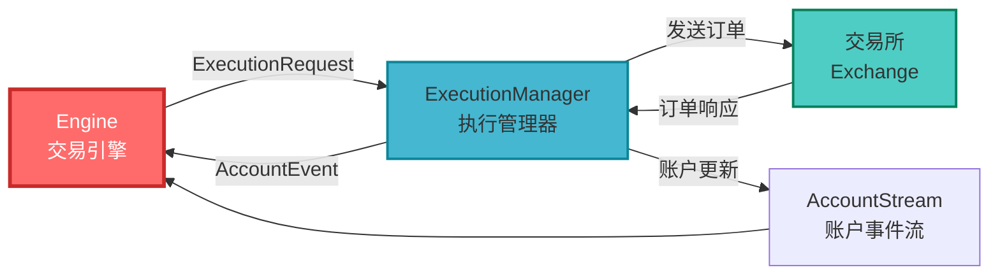
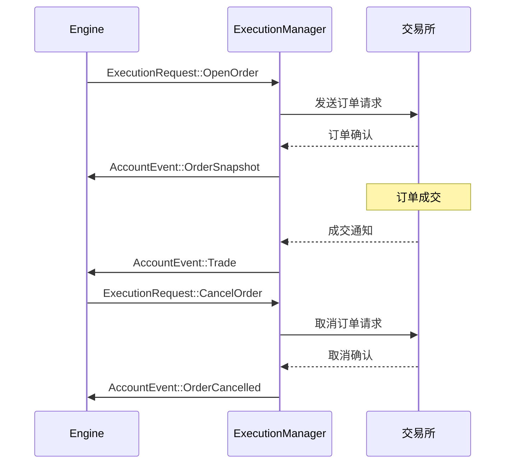
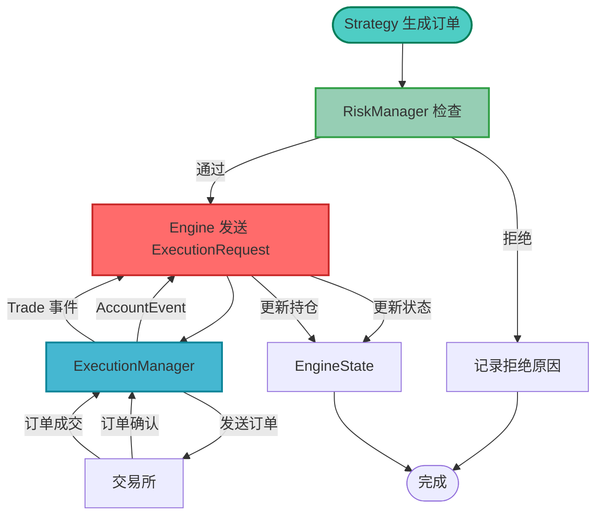
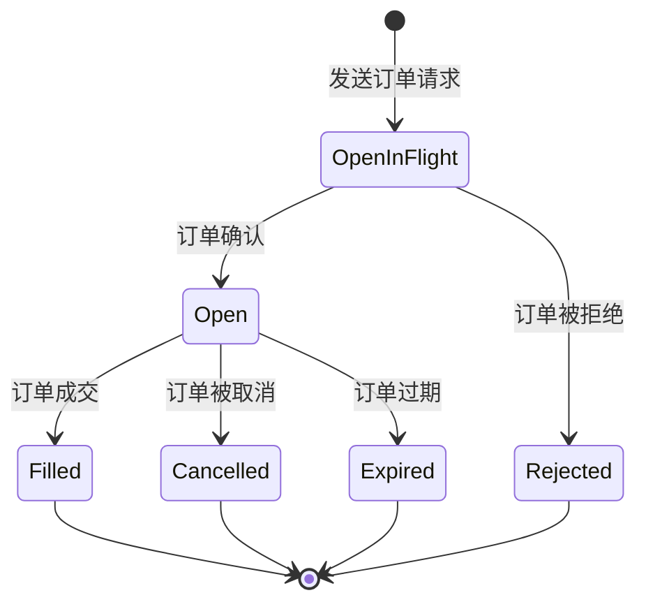

# 05-订单执行

订单执行是交易系统的关键环节。本教程将深入讲解 Barter-rs 的订单执行系统，包括如何发送订单、管理订单状态和处理执行结果。

## 🎯 学习目标

完成本教程后，你将能够：

-   ✅ 理解 Execution 系统的工作原理
-   ✅ 了解订单类型和订单状态
-   ✅ 使用 ExecutionManager 发送订单
-   ✅ 处理订单执行结果
-   ✅ 区分模拟执行和实盘执行

## 🏗️ Execution 系统概述

### 什么是 Execution 系统？

**Execution 系统（执行系统）** 是 Engine 与交易所之间的桥梁，负责：

-   接收 Engine 的订单请求
-   将订单发送到交易所
-   接收交易所的响应
-   管理订单生命周期
-   处理账户事件

### 系统架构



### 执行流程



## 📋 订单类型

### OrderRequestOpen（开仓订单）

**定义**：请求开仓的订单

**包含信息**：

-   `side`：买卖方向（Buy/Sell）
-   `price`：订单价格
-   `quantity`：订单数量
-   `kind`：订单类型（Market/Limit）
-   `time_in_force`：有效期类型

**代码示例**：

```rust
use barter_execution::order::{
    request::{OrderRequestOpen, RequestOpen},
    id::{ClientOrderId, StrategyId},
};
use barter_instrument::{Side, OrderKind, TimeInForce};

let order_request = OrderRequestOpen {
    key: OrderKey {
        exchange: exchange_index,
        instrument: instrument_index,
        strategy: strategy_id,
        cid: ClientOrderId::random(),
    },
    state: RequestOpen {
        side: Side::Buy,
        price: dec!(50000.0),
        quantity: dec!(0.1),
        kind: OrderKind::Limit,
        time_in_force: TimeInForce::Gtc,
    },
};
```

### OrderRequestCancel（取消订单）

**定义**：请求取消的订单

**包含信息**：

-   `id`：要取消的订单 ID（可选）

**代码示例**：

```rust
use barter_execution::order::request::OrderRequestCancel;

let cancel_request = OrderRequestCancel {
    key: OrderKey {
        exchange: exchange_index,
        instrument: instrument_index,
        strategy: strategy_id,
        cid: ClientOrderId::random(),
    },
    state: RequestCancel {
        id: Some(order_id),  // 指定要取消的订单 ID
    },
};
```

## 🔄 订单执行流程

### 完整执行流程



### 订单状态生命周期



## 🎭 模拟执行 vs 实盘执行

### MockExecutionClient（模拟执行）

**特点**：

-   不连接真实交易所
-   模拟订单执行过程
-   用于回测和开发测试
-   可以配置延迟和手续费

**使用场景**：

-   策略开发和测试
-   回测系统
-   学习系统使用

**代码示例**：

```rust
use barter_execution::client::mock::MockExecutionClient;
use barter_execution::exchange::mock::MockExchange;

// 创建模拟交易所配置
let mock_config = MockExecutionConfig {
    mocked_exchange: ExchangeId::BinanceSpot,
    latency_ms: 100,        // 模拟延迟 100ms
    fees_percent: dec!(0.1), // 手续费 0.1%
    initial_state: account_snapshot,
};

// 创建模拟执行客户端
let mock_client = MockExecutionClient::new(mock_config);
```

### 真实 ExecutionClient

**特点**：

-   连接真实交易所
-   执行真实订单
-   需要 API 密钥
-   有真实资金风险

**使用场景**：

-   实盘交易
-   模拟交易（使用交易所的模拟环境）

**注意事项**：

-   ⚠️ 需要妥善保管 API 密钥
-   ⚠️ 注意资金安全
-   ⚠️ 建议先在模拟环境测试

## 📊 订单状态管理

### OrderManager

`OrderManager` 管理订单的完整生命周期：

```rust
// 在 EngineState 中，每个交易对都有自己的 OrderManager
let order_manager = &instrument_state.orders;

// 获取所有未完成订单
let open_orders = order_manager.active();

// 获取特定订单
if let Some(order) = order_manager.get(&order_id) {
    // 处理订单
}
```

### 订单状态查询

```rust
// 检查订单是否存在
if let Some(order) = instrument_state.orders.get(&order_id) {
    match &order.state {
        OrderState::Active(active) => {
            println!("订单状态: {:?}", active);
        }
        OrderState::Inactive(inactive) => {
            println!("订单已结束: {:?}", inactive);
        }
    }
}
```

## 🔍 处理账户事件

### AccountEvent 类型

账户事件包含多种类型：

```rust
pub enum AccountEventKind {
    Snapshot(AccountSnapshot),           // 完整账户快照
    BalanceSnapshot(Snapshot<AssetBalance>),  // 余额更新
    OrderSnapshot(Snapshot<Order>),     // 订单状态更新
    OrderCancelled(OrderResponseCancel), // 订单取消响应
    Trade(Trade),                        // 交易成交
}
```

### 处理账户事件示例

```rust
fn handle_account_event(event: AccountEvent) {
    match &event.kind {
        AccountEventKind::Snapshot(snapshot) => {
            // 处理完整账户快照
            println!("收到账户快照: {:?}", snapshot);
        }
        AccountEventKind::BalanceSnapshot(balance) => {
            // 处理余额更新
            println!("余额更新: {:?}", balance);
        }
        AccountEventKind::OrderSnapshot(order) => {
            // 处理订单状态更新
            println!("订单更新: {:?}", order);
        }
        AccountEventKind::Trade(trade) => {
            // 处理交易成交
            println!("交易成交: {:?}", trade);
        }
        AccountEventKind::OrderCancelled(cancelled) => {
            // 处理订单取消
            println!("订单已取消: {:?}", cancelled);
        }
    }
}
```

## 🎯 实际应用示例

### 示例 1：发送限价单

```rust
use barter_execution::order::{
    request::{OrderRequestOpen, RequestOpen},
    id::{ClientOrderId, StrategyId},
};
use barter_instrument::{Side, OrderKind, TimeInForce};

fn create_limit_order(
    exchange: ExchangeIndex,
    instrument: InstrumentIndex,
    strategy: StrategyId,
    side: Side,
    price: Decimal,
    quantity: Decimal,
) -> OrderRequestOpen {
    OrderRequestOpen {
        key: OrderKey {
            exchange,
            instrument,
            strategy,
            cid: ClientOrderId::random(),
        },
        state: RequestOpen {
            side,
            price,
            quantity,
            kind: OrderKind::Limit,
            time_in_force: TimeInForce::Gtc,
        },
    }
}
```

### 示例 2：发送市价单

```rust
fn create_market_order(
    exchange: ExchangeIndex,
    instrument: InstrumentIndex,
    strategy: StrategyId,
    side: Side,
    quantity: Decimal,
) -> OrderRequestOpen {
    OrderRequestOpen {
        key: OrderKey {
            exchange,
            instrument,
            strategy,
            cid: ClientOrderId::random(),
        },
        state: RequestOpen {
            side,
            price: Decimal::ZERO,  // 市价单价格通常为 0
            quantity,
            kind: OrderKind::Market,
            time_in_force: TimeInForce::Ioc,  // Immediate Or Cancel
        },
    }
}
```

### 示例 3：取消订单

```rust
use barter_execution::order::{
    request::OrderRequestCancel,
    id::OrderId,
};

fn create_cancel_request(
    exchange: ExchangeIndex,
    instrument: InstrumentIndex,
    strategy: StrategyId,
    order_id: OrderId,
) -> OrderRequestCancel {
    OrderRequestCancel {
        key: OrderKey {
            exchange,
            instrument,
            strategy,
            cid: ClientOrderId::random(),
        },
        state: RequestCancel {
            id: Some(order_id),
        },
    }
}
```

## ⚠️ 常见问题

### 问题 1：订单为什么没有执行？

**解答**：检查以下几点：

-   订单是否通过风险检查
-   资金是否充足
-   订单价格是否合理（限价单）
-   交易所连接是否正常
-   订单是否被交易所拒绝

### 问题 2：如何处理订单被拒绝？

**解答**：

-   检查 `AccountEvent::OrderSnapshot` 中的拒绝原因
-   验证订单参数是否正确
-   检查交易所的限制（最小订单量、价格精度等）
-   查看日志了解详细错误信息

### 问题 3：市价单和限价单的区别？

**解答**：

-   **市价单**：以当前市场价格立即成交，价格不确定
-   **限价单**：指定价格，只有价格达到时才成交
-   **选择建议**：
    -   需要快速成交：使用市价单
    -   需要控制价格：使用限价单

## ✅ 检查清单

完成以下任务，确保你掌握了订单执行：

-   [ ] 理解 Execution 系统架构
-   [ ] 知道如何创建订单请求
-   [ ] 理解订单状态生命周期
-   [ ] 能够处理账户事件
-   [ ] 理解模拟执行和实盘执行的区别
-   [ ] 知道如何取消订单

## 🎯 下一步

现在你已经掌握了订单执行，可以继续学习：

1.  **[06-风险管理](./06-风险管理.md)** - 实现更完善的风险管理
2.  **[07-回测系统](./07-回测系统.md)** - 使用历史数据测试策略
3.  **[08-实盘交易](./08-实盘交易.md)** - 配置和部署实盘交易

## 📚 延伸阅读

-   [Barter-Execution 文档](https://docs.rs/barter-execution/latest/barter_execution/)
-   [ExecutionRequest 文档](https://docs.rs/barter/latest/barter/execution/request/)
-   [AccountEvent 文档](https://docs.rs/barter-execution/latest/barter_execution/struct.AccountEvent.html)
-   [术语表](./术语表.md)

---

**继续学习，完善你的交易系统！** 🚀
