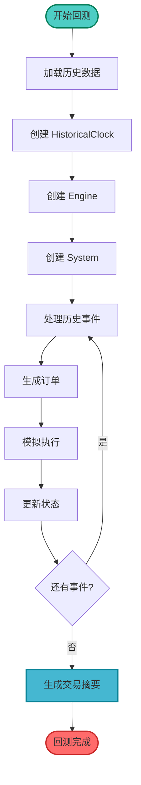

# 07-回测系统

回测是验证策略有效性的关键步骤。本教程将深入讲解如何使用 Barter-rs 的回测系统，使用历史数据测试策略性能。

## 🎯 学习目标

完成本教程后，你将能够：

-   ✅ 理解回测的概念和作用
-   ✅ 准备历史市场数据
-   ✅ 运行单个回测
-   ✅ 运行批量并发回测
-   ✅ 分析回测结果和性能指标
-   ✅ 优化策略参数

## 🔄 回测概述

### 什么是回测？

**回测（Backtesting）** 是使用历史数据模拟交易策略的过程。它让你能够：

-   验证策略在历史数据上的表现
-   优化策略参数
-   评估策略风险
-   避免在实盘上测试策略

### 回测 vs 实盘交易

| 特性     | 回测           | 实盘交易       |
| -------- | -------------- | -------------- |
| 数据来源 | 历史数据       | 实时数据       |
| 执行方式 | 模拟执行       | 真实执行       |
| 时间控制 | 可以加速       | 实时           |
| 成本     | 无资金成本     | 有真实资金风险 |
| 用途     | 策略验证和优化 | 实际交易       |

### 回测的局限性

⚠️ **重要提醒**：回测结果不能保证未来表现

-   历史数据可能不完整
-   无法模拟滑点和流动性问题
-   无法考虑市场情绪和突发事件
-   可能存在过拟合风险

## 📊 回测系统架构

### 回测流程



### 核心组件

1.  **HistoricalClock**：历史时钟，使用历史事件的时间戳
2.  **BacktestMarketData**：回测市场数据接口
3.  **MockExecutionClient**：模拟执行客户端
4.  **TradingSummary**：交易摘要和性能指标

## 📁 准备历史数据

### 数据格式

历史数据应该是 `MarketStreamEvent` 的集合：

```rust
// 每行一个 JSON 格式的 MarketStreamEvent
{"time_exchange":"2024-01-01T00:00:00Z","time_received":"2024-01-01T00:00:00Z","exchange":"BinanceSpot","instrument":...,"kind":...}
{"time_exchange":"2024-01-01T00:00:01Z","time_received":"2024-01-01T00:00:01Z","exchange":"BinanceSpot","instrument":...,"kind":...}
```

### 从文件加载数据

```rust
use barter_data::streams::consumer::MarketStreamEvent;
use std::{fs::File, io::BufReader};

fn load_market_data_from_file<InstrumentKey, Kind>(
    file_path: &str,
) -> Vec<MarketStreamEvent<InstrumentKey, Kind>>
where
    InstrumentKey: for<'de> serde::Deserialize<'de>,
    Kind: for<'de> serde::Deserialize<'de>,
{
    let file = File::open(file_path).unwrap();
    let reader = BufReader::new(file);

    reader
        .lines()
        .map(|line_result| {
            let line = line_result.unwrap();
            serde_json::from_str::<MarketStreamEvent<InstrumentKey, Kind>>(&line).unwrap()
        })
        .collect()
}
```

### 创建回测市场数据

```rust
use barter::backtest::market_data::MarketDataInMemory;
use std::sync::Arc;

let market_events = load_market_data_from_file("path/to/market_data.json");
let market_data = MarketDataInMemory::new(Arc::new(market_events));
```

## 🚀 运行单个回测

### 基本回测示例

```rust
use barter::{
    backtest::{
        BacktestArgsConstant, BacktestArgsDynamic,
        market_data::MarketDataInMemory,
        backtest,
    },
    engine::state::{
        EngineState, builder::EngineStateBuilder,
        global::DefaultGlobalData,
        instrument::data::DefaultInstrumentMarketData,
        trading::TradingState,
    },
    risk::DefaultRiskManager,
    statistic::time::Daily,
    strategy::DefaultStrategy,
    system::config::SystemConfig,
};
use barter_instrument::index::IndexedInstruments;
use rust_decimal::Decimal;
use rust_decimal_macros::dec;
use std::sync::Arc;

#[tokio::main]
async fn main() -> Result<(), Box<dyn std::error::Error>> {
    // 1. 加载配置
    let SystemConfig { instruments, executions } = load_config()?;
    let instruments = IndexedInstruments::new(instruments);

    // 2. 准备历史市场数据
    let market_events = load_market_data_from_file("market_data.json");
    let market_data = MarketDataInMemory::new(Arc::new(market_events));
    let time_start = market_data.time_first_event().await?;

    // 3. 构建 EngineState
    let engine_state = EngineState::builder(
        &instruments,
        DefaultGlobalData::default(),
        |_| DefaultInstrumentMarketData::default(),
    )
    .time_engine_start(time_start)
    .trading_state(TradingState::Enabled)
    .build();

    // 4. 构建常量参数
    let args_constant = Arc::new(BacktestArgsConstant {
        instruments,
        executions,
        market_data,
        summary_interval: Daily,
        engine_state,
    });

    // 5. 构建动态参数（策略和风险管理器）
    let args_dynamic = BacktestArgsDynamic {
        id: "my_backtest".into(),
        risk_free_return: dec!(0.05),  // 5% 无风险收益率
        strategy: MyStrategy::new(),
        risk: MyRiskManager::new(),
    };

    // 6. 运行回测
    let summary = backtest(args_constant, args_dynamic).await?;

    // 7. 分析结果
    println!("回测 ID: {}", summary.id);
    summary.trading_summary.print_summary();

    Ok(())
}
```

## 🔄 运行批量并发回测

### 并发回测示例

当你需要测试多个策略参数时，可以使用并发回测：

```rust
use barter::backtest::run_backtests;

// 构建常量参数（所有回测共享）
let args_constant = Arc::new(BacktestArgsConstant {
    instruments,
    executions,
    market_data,
    summary_interval: Daily,
    engine_state,
});

// 构建动态参数迭代器（每个回测不同）
let args_dynamic_iter = vec![
    BacktestArgsDynamic {
        id: "strategy_v1".into(),
        risk_free_return: dec!(0.05),
        strategy: StrategyV1::new(),
        risk: RiskManagerV1::new(),
    },
    BacktestArgsDynamic {
        id: "strategy_v2".into(),
        risk_free_return: dec!(0.05),
        strategy: StrategyV2::new(),
        risk: RiskManagerV2::new(),
    },
    // ... 更多策略变体
];

// 并发运行所有回测
let multi_summary = run_backtests(args_constant, args_dynamic_iter).await?;

// 分析结果
println!("总回测数: {}", multi_summary.num_backtests);
println!("总耗时: {:?}", multi_summary.duration);

// 找到最佳回测
let best = multi_summary
    .summaries
    .iter()
    .max_by_key(|s| {
        // 根据某个指标排序，例如总盈亏
        s.trading_summary.instruments
            .values()
            .map(|tear| tear.pnl)
            .sum::<Decimal>()
    })
    .unwrap();

println!("最佳回测: {}", best.id);
best.trading_summary.print_summary();
```

## 📈 性能指标分析

### TradingSummary 包含的指标

回测完成后，`TradingSummary` 包含丰富的性能指标：

#### 1. 盈亏指标（PnL）

-   **总盈亏**：所有交易对的总盈亏
-   **已实现盈亏**：已平仓部分的盈亏
-   **未实现盈亏**：当前持仓的估算盈亏

#### 2. 风险调整后收益

-   **Sharpe Ratio（夏普比率）**：风险调整后收益指标
-   **Sortino Ratio（索提诺比率）**：下行风险调整收益指标
-   **Calmar Ratio（卡玛比率）**：收益/最大回撤比率

#### 3. 回撤指标

-   **Max Drawdown（最大回撤）**：最大资金回撤
-   **Mean Drawdown（平均回撤）**：平均回撤水平

#### 4. 交易统计

-   **Win Rate（胜率）**：盈利交易占比
-   **Profit Factor（盈利因子）**：总盈利/总亏损
-   **交易次数**：总交易笔数

### 查看回测结果

```rust
// 打印完整摘要
trading_summary.print_summary();

// 访问特定指标
let total_pnl = trading_summary
    .instruments
    .values()
    .map(|tear| tear.pnl)
    .sum::<Decimal>();

let sharpe_ratio = trading_summary
    .instruments
    .values()
    .next()
    .map(|tear| tear.sharpe_ratio);

println!("总盈亏: {}", total_pnl);
println!("夏普比率: {:?}", sharpe_ratio);
```

## 🎯 策略参数优化

### 参数网格搜索

通过批量回测测试不同的参数组合：

```rust
// 定义参数范围
let breakout_periods = vec![10, 20, 30, 40, 50];
let stop_loss_periods = vec![5, 10, 15, 20];
let position_sizes = vec![dec!(0.05), dec!(0.10), dec!(0.15)];

// 生成所有参数组合
let mut args_dynamic_iter = Vec::new();
for &breakout in &breakout_periods {
    for &stop_loss in &stop_loss_periods {
        for &position_size in &position_sizes {
            args_dynamic_iter.push(BacktestArgsDynamic {
                id: format!("b{}_s{}_p{}", breakout, stop_loss, position_size).into(),
                risk_free_return: dec!(0.05),
                strategy: BreakoutStrategy::new(breakout, stop_loss, position_size),
                risk: DefaultRiskManager::default(),
            });
        }
    }
}

// 运行批量回测
let multi_summary = run_backtests(args_constant, args_dynamic_iter).await?;

// 找到最佳参数组合
let best = multi_summary
    .summaries
    .iter()
    .max_by_key(|s| {
        // 根据夏普比率选择
        s.trading_summary.instruments
            .values()
            .next()
            .map(|tear| tear.sharpe_ratio)
            .unwrap_or(Decimal::ZERO)
    })
    .unwrap();
```

## ⚠️ 回测注意事项

### 1. 数据质量

-   确保历史数据完整准确
-   检查数据是否有缺失或异常
-   验证数据时间戳的正确性

### 2. 避免过拟合

-   不要过度优化参数
-   使用样本外数据验证
-   保持策略逻辑简单

### 3. 考虑交易成本

-   在回测中包含手续费
-   考虑滑点影响
-   使用合理的执行延迟

### 4. 结果解读

-   回测结果不代表未来表现
-   关注风险指标，不仅仅是收益
-   考虑市场环境的变化

## ✅ 检查清单

完成以下任务，确保你掌握了回测系统：

-   [ ] 理解回测的概念和局限性
-   [ ] 能够准备历史市场数据
-   [ ] 能够运行单个回测
-   [ ] 能够运行批量并发回测
-   [ ] 能够分析回测结果
-   [ ] 知道如何优化策略参数

## 🎯 下一步

现在你已经掌握了回测系统，可以继续学习：

1.  **[08-实盘交易](./08-实盘交易.md)** - 配置和部署实盘交易
2.  **[09-常见问题](./09-常见问题.md)** - 查找遇到的问题
3.  **[10-最佳实践](./10-最佳实践.md)** - 了解更多开发建议

## 📚 延伸阅读

-   [Backtest 模块文档](https://docs.rs/barter/latest/barter/backtest/)
-   [TradingSummary 文档](https://docs.rs/barter/latest/barter/statistic/summary/struct.TradingSummary.html)
-   [术语表](./术语表.md)

---

**回测是策略验证的重要步骤，务必认真对待！** 📊
